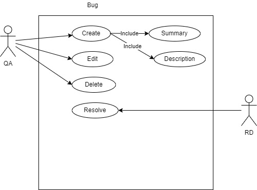
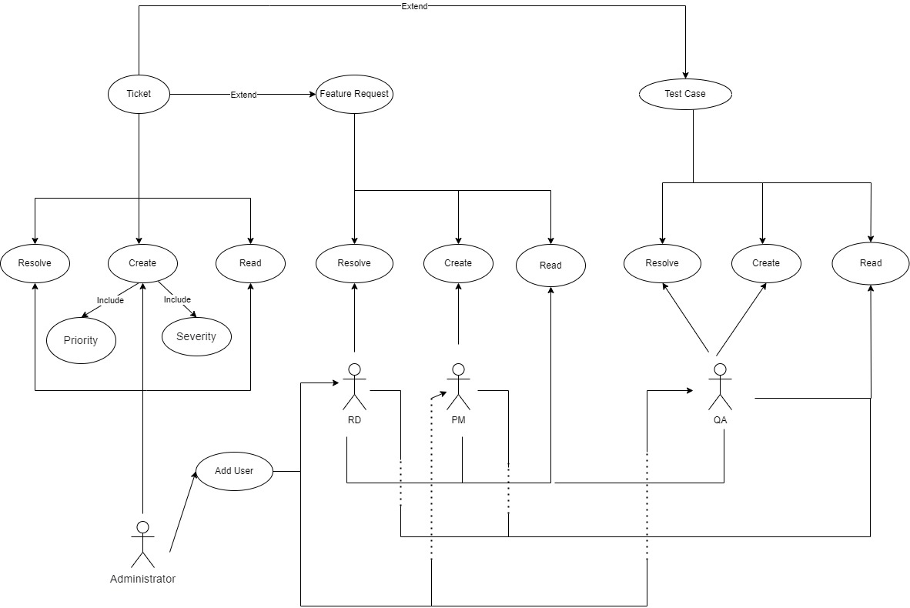
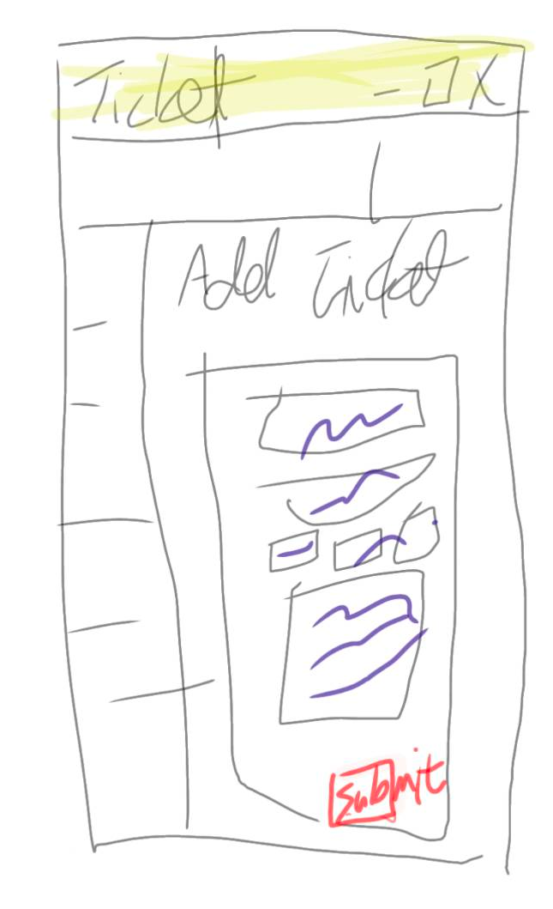

## Task 1

#### Phase 1:

#### Phase 2:

## Task 3

### Data Model
* employees
    * columns
        * id - primary key unsigned big integer
        * name - string(50)
        * type - tiny unsigned int index('type')
        * created_at date
        * updated_at date

* tickets
    * columns
        * id - primary key unsigned big integer
        * type - tiny unsigned int index('type')
        * status - tiny unsigned int index('status')
        * priority - tiny unsigned int index('priority')
        * severity - tiny unsigned int index('severity')
        * employee_id - unsigned big integer comment ('ticket 提出者 id')
        * description - text
        * summary - text nullable
        * created_at date
        * updated_at date
    * foreign keys
        * employee_id on employees.id

* permissions
    * columns
        * id - primary key unsigned big integer
        * name - string(255)
        * created_at date
        * updated_at date

* employee_permissions
    * columns
        * id - primary key unsigned big integer
        * permission_id unsigned big integer
        * employee_type unsigned big integer
        * created_at date
        * updated_at date
    * foreign keys
        * permission_id on permissions.id

### Class diagram

* Employees
    * create
* Ticket
    * get
    * create
    * resolve
* Permission
    * check
    * add
    * delete
 
 ### UI mock up
 
 
 

## Task 4 

### API documentation

#### 取得使用者所有 ticket
| Method | path  |
|---|---|
| GET  | /tickets  |

##### 參數說明

* token: 申請 API 使用之 token
    * 必填

##### 回傳值說明

* status: API 執行結果
    * success: 成功
    * fail: 失敗
* message: API 結果說明
* data: tickets 相關資料，每筆 ticket 包含
    * id: ticket id
    * type: ticket 類型
    * title: ticket 名稱
    * status: ticket 狀態
    
#### 取得單筆 ticket 資料
| Method | path  |
|---|---|
| GET  | /tickets/{id}  |

##### 參數說明

* token: 申請 API 使用之 token
    * 必填
* id: ticket id
    * 必填

##### 回傳值說明

* status: API 執行結果
    * success: 成功
    * fail: 失敗
* message: API 結果說明
* data: ticket 資料
    * id: ticket id
    * type: ticket 類型
    * title: ticket 標題
    * status: ticket 狀態
    * content: ticket 內容
    
#### 新增 ticket
| Method | path  |
|---|---|
| POST  | /tickets/  |

##### 參數說明

* token: 申請 API 使用之 token
    * 必填
* title: ticket 標題
* content: ticket 內容
* type: ticket 類型

##### 回傳值說明

* status: API 執行結果
    * success: 成功
    * fail: 失敗
* message: API 結果說明
* data: ticket 資料
    * id: ticket id
        
